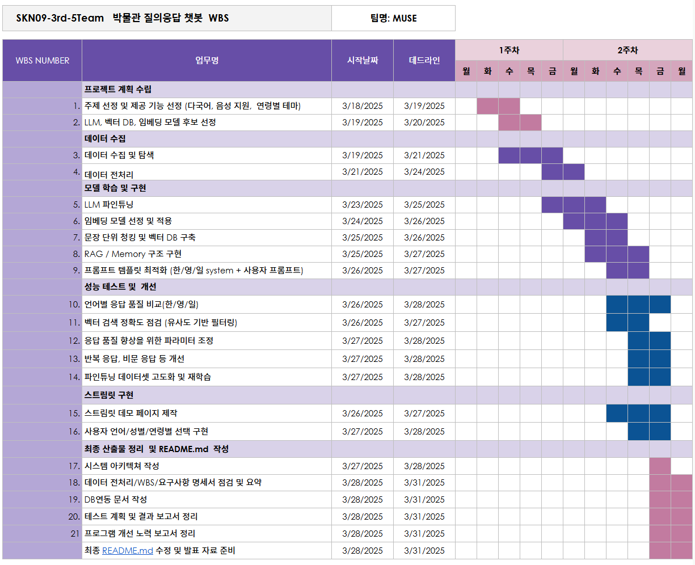
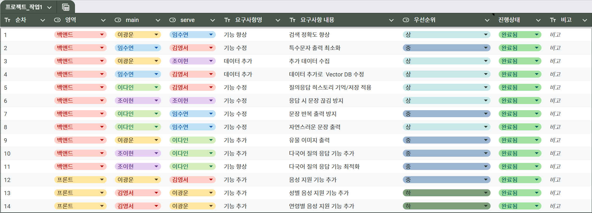
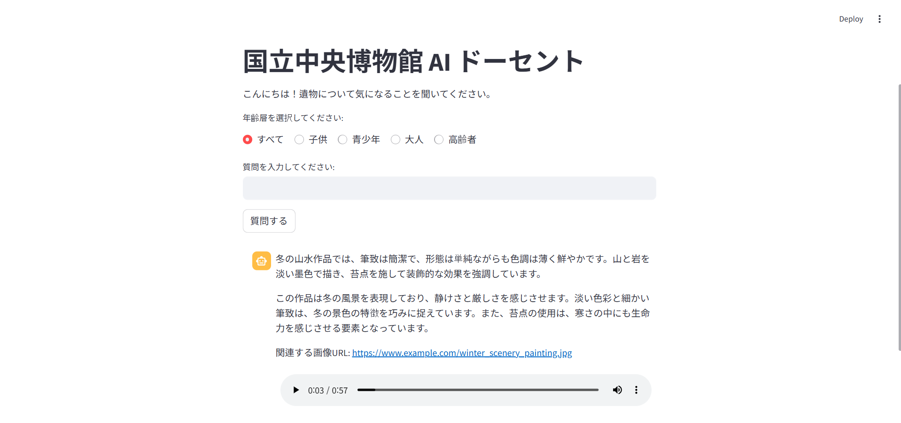
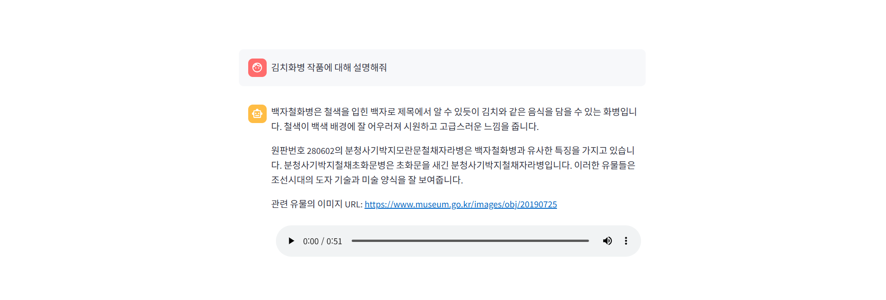

# **SKN09-3rd-5Team** 

> SK네트웍스 Family AI 캠프 9기 3차 프로젝트<br>
> 개발기간: 25.03.18 - 25.03.31

<br>

---

# 📚 Contents

1. [팀 소개](#1-introduce-team)
2. [프로젝트 개요](#2-project-overview)
3. [기술 스택 및 사용 모델](#3-technology-stack--models)
4. [시스템 아키텍처](#4-시스템-아키텍처)
5. [WBS](#5-wbs)
6. [요구사항 명세서](#6-요구사항-명세서)
7. [수집한 데이터 및 전처리 요약](#7-수집한-데이터-및-전처리-요약)
8. [벡터 DB 구축](#8-벡터-db-구축)
9. [테스트 계획 및 결과 보고서](#9-테스트-계획-및-결과-보고서)
10. [모델 질의 성능 개선 과정](#10-모델-질의-성능-개선-과정)
11. [수행결과(시연 페이지)](#11-수행결과시연-페이지)
12. [디렉토리 구조](#12-디렉토리-구조)
13. [결론](#13-결론)
14. [추후 업데이트 계획](#14-추후-업데이트-계획)
15. [한 줄 회고](#15-한-줄-회고)
<br>
<br>

---

# 1. Introduce Team

#### 💡팀명: MUSE (Multilingual Universal Storyteller Engine)
#### 💡프로젝트명: LLM기반 박물관 도슨트 질의응답 서비스
<br>

##### ⬇️팀원 소개 ⬇️

<table align="center" width="100%">
  <tr>
    <td align="center">
      <a href="https://github.com/youngseo98"><b>@김영서</b></a>
    </td>
    <td align="center">
      <a href="https://github.com/Leegwangwoon"><b>@이광운</b></a>
    </td>
    <td align="center">
      <a href="https://github.com/daainn"><b>@이다인</b></a>
    </td>
    <td align="center">
      <a href="https://github.com/ohback"><b>@임수연</b></a>
    </td>
    <td align="center">
      <a href="https://github.com/SIQRIT"><b>@조이현</b></a>
    </td>
  </tr>
  <tr>
    <td align="center"></td>
    <td align="center"></td>
    <td align="center"></td>
    <td align="center"></td>
    <td align="center"></td>
  </tr>
</table>

---


# 2. Project Overview
### ✅ 프로젝트 소개
해당 프로젝트에서는 LLM(대형 언어 모델)을 기반으로 **박물관 도슨트 질의응답 챗봇 서비스**를 개발하였습니다. 사용자가 박물관의 작품 정보가 궁금할 때, 다양한 언어로 문화적 정보와 이야기를 제공할 수 있는 시스템을 구축하여, 더 많은 사람들이 세계 여러 문화를 쉽고 재미있게 접할 수 있도록 돕습니다. 

### ✅ 프로젝트 필요성

현재 국립중앙박물관 애플리케이션에는 ‘스마트전시관 챗봇’ 서비스가 제공되고 있으며, 박물관 내 건물과 전시품의 위치를 효과적으로 안내하는 데 특화되어 있습니다.

저희는 여기서 한 걸음 더 나아가, **작품에 대한 충분한 맥락과 이해를 제공하는 기능이 더해진다면**  관람객의 **이해도와 몰입도**를 더욱 높일 수 있을 것이라 판단하였습니다.  
이에 따라 본 프로젝트는 **작품 설명에 특화된 질의응답형 도슨트 챗봇**의 필요성을 바탕으로 기획되었습니다.

또한 최근 다양한 분야에서 사용자 맞춤형 서비스가 확대되는 흐름에 따라, 본 챗봇에  
- **다국어 지원 기능**을 통해 외국인 관람객의 접근성을 높이고  
- **음성 기반 설명 기능**으로 시각 외 정보 전달 방식을 확장하며  
- **연령별 맞춤 콘텐츠 제공**을 통해 다양한 관람층의 수요를 반영하는 등  

사용자 중심의 기능들을 추가하여 **보다 포괄적이고 몰입감 있는 박물관 관람 경험**을 구현하고자 하였습니다.


<table align="center">
  <tr>
    <td align="center">
      
    </td>
    <td align="center">
      
    </td>
  </tr>
</table>
> 현재 국립중앙박물관 챗봇 서비스에는 작품 설명에 관한 챗봇 시스템은 따로 구현되어 있지 않습니다.


### ✅ 프로젝트 목표
- 전시품 설명에 특화된 질의응답형 챗봇 서비스 개발
- 다국어 지원을 통한 관람객 접근성 및 경험 향상
- 음성 기반의 전시품 설명 기능 제공
- 자연어 처리 기반의 연령 맞춤형 콘텐츠 제공


<br>

---

# 3. Technology Stack & Models

## ✅ 기술 스택 및 사용한 모델


| **Language** | **Development** | **Embedding Model** | **Vector DB** | **LLM Model** | **Framework** | **Demo** | **Collaboration Tool** |
|--------------|------------------|----------------------|----------------|----------------|----------------|-------------|--------------------|
|  | <br><br> | <br><sub><a href="https://huggingface.co/intfloat/multilingual-e5-large">모델 주소</a></sub> |  | <br><br><sub>:현재 개발중</sub> |  |  | <br><br> |


<br><br>

---

# 4. 시스템 아키텍처

<div align="center">
  
</div>


---

# 5. WBS



<br><br>

---

# 6. 요구사항 명세서



<br><br>

---

# 7. 수집한 데이터 및 전처리 요약

## ✅ 데이터 수집
- '국립중앙박물관' 홈페이지에서 작품명과과 이미지url, 작품 설명을 크롤링하여 총 3만건의 박물관 유물 데이터 수집.


## ✅ 데이터 전처리

1. 데이터 중복 제거
2. 작품 설명이 `NaN`인 행 제거
> 전처리 후 최종 데이터셋: 7000건

`text = re.sub(r'사료조사[1-5]', '', text)`

- 형식적 구분자 제거
- 영어/일본어 제외
- 줄임표(...), 물음표 등 제외 

### ✅ Fine-tuning용 데이터셋 전처리
목적: 모델이 핵심 개념과 키워드를 잘 학습할 수 있도록 불필요한 정보 제거

한글과 숫자만 유지, 그 외 문자(한자 포함)는 모두 제거
→ 복잡한 특수문자, 한자 등으로 인한 키워드 추출 오류 방지
→ 한자 제거로 조사, 접속사만 남은 불완전한 문장 패턴 제거
```meaningless_patterns = r'^\s*(달고|달았음|으로|로서|이고|한|있음|만|마다|새긴|달었음|록로|팠음|폭|은|에는||을|를|에|과|와|및|의|로|에서|과 함께|의 경우|을 위해|을 통해|및 에선|을 하였음|에 있음|을 들었음|으로 하였음|및 으로|을 하여|있음|달았음|하였음)\s*$'```


### ✅ RAG용 데이터셋 전처리
목적: 검색 기반 응답 정확도를 높이기 위해 실제 문서의 의미를 최대한 보존

예시: `백중력(百中曆)`

한글과 한자 유지, 필요 최소한의 특수문자만 허용
→ RAG 검색 시 고유명사, 역사적 표현 보존을 위한 설계


<br><br>

---

# 8. 벡터 DB 구축

* 추후 업데이트 시 전국 박물관 데이터 수집을 고려하여 대규모 데이터를 다룰 수 있는 FAISS로 벡터 DB선정

**사용한 벡터 DB : FAISS**

> 벡터 DB 구축 관련 코드는 아래에서 확인 가능합니다.<br>
🔗 [벡터 DB 구축 및 청킹 관련 코드](https://github.com/SKNETWORKS-FAMILY-AICAMP/SKN09-3rd-5Team/blob/main/Embedding_model_changed.ipynb)


<br>

---

# 9. 테스트 계획 및 결과 보고서


> ##### **테스트 목적**: `챗봇의 질의응답 정확도, 다국어 대응 능력, 검색 기반 응답의 적절성(RAG) 등을 검증.`


###  ✅테스트 환경

| 항목        | 설정값 |
|-------------|--------|
| 모델        | `qwen2.5-7b` (LoRA 파인튜닝 적용) |
| 임베딩 모델 | `intfloat/multilingual-e5-large` |
| 벡터 DB     | FAISS |
| 프레임워크  | Streamlit (Web UI) |

<br>

###  ✅테스트 시나리오 (Test Cases)

| Test ID | 목적                      | 입력 예시                               | 기대 결과                                 |
|---------|---------------------------|------------------------------------------|--------------------------------------------|
| TC01    | 유물 설명 응답 정확도     | `겨울 산수에 대해 알려줘`                | 작품명, 작가, 표현 기법 포함한 정확한 설명 |
| TC02    | 키워드 추출 능력          | `겨울 산수 작품의의 핵심 키워드는?` | "산수" 또는 "산수화" 등 핵심 개념 추출     |
| TC03    | 다국어 질의 대응 (EN)     | `Tell me about winter landscape painting`| 영어로 자연스러운 유물 설명 응답           |
| TC04    | 다국어 질의 대응 (JP)     | `冬景山水図について教えて`                | 일본어로 자연스러운 유물 설명 응답         |
| TC05    | 벡터 DB에 존재하지 않는 유물 대응   | `김치 화병에 대해서 알려줘`                              | "정보 없음" 혹은 위키피디아에서 내용 검색 후 관련 내용을 출력         |
| TC06   | 유사 질문 반복 대응       | `탑명 동판`, `염거화상 탑명 동판`         | 동일 유물에 대해 일관된 응답 제공           |

<br>

### ✅ 결과 보고서

#### 성공 사례

| 문제 유형 | 질의 | 응답 |
|------|------|------|
|응답 정확도 | `겨울 산수에 대해 알려줘` | `이 겨울 산수 그림은 김수철의 작품으로 조선 말기 유행하던 이색적인 화풍을 보여줍니다. 간략한 필치와 단순한 형태로 표현되었으며 엷지만 선명한 색채가 돋보입니다. 마지막 폭에는 눈 덮인 산 속에서 갓과 도롱이를 입고 길을 가는 사람들의 광경이 묘사되어 있습니다. 이러한 특징들은 당시 화가들이 새로운 감각을 추구하려는 시도를 보여주고 있습니다.`|
| 🇺🇸 English 질의 응답 | `Tell me about winter landscape painting` | `Certainly! Let's explore some notable winter landscape paintings that capture the essence of cold and serene environments.One such painting is "Heachilmunseok" which translates to "Evening Snow in the Mountains and Fields....` |
| 🇯🇵 日本語 질의 응답  | 冬景山水図について教えて | `冬の山水作品では、筆致は簡潔で、形態は単純ながらも色調は薄く鮮やかです。山と岩を淡い墨色で描き、苔点を施して装飾的な効果を強調しています。この作品は冬の風景を表現しており、静けさと厳しさを感じさせます。淡い色彩と細かい筆致は、冬の景色の特徴を巧みに捉えています。また、苔点の使用は、寒さの中にも生命力を感じさせる要素となっています。関連する画像URL: https://www.example.com/winter_scenery_painting.jpg` |
| 키워드 추출 능력 | `겨울 산수 작품의의 핵심 키워드는?` | `겨울산수 작품의 핵심 키워드는 간결한 필티, 단순한 형태, 엷지만 선명한 색체, 임포와의 대비 등이 있습니다. 겨울의 차가운 분위기를 담아내면서도 시원하고 고급스러운 느낌을 준다` |
| 유사 질문 반복 대응 | `겨울 산수 작품에 대해서 설명해줘`| 같은 질문에 대해 여러번 물어봐도 같은 내용의 응답을 잘 생성함. |

<br>

#### ⚠️ 개선 필요 사례

| 문제 유형 | 질의 | 응답 | 문제 |
|-----------|------|------|--------|
| 존재하지 않는 유물 대응 | `김치 화병에 대해서 알려줘` | `백자 철화병은 철색을 입힌 백자로 제목에서 알 수 있듯이 김치와 같은 음식을 담을 수 있는 화병입니다. 원판번호 280602의 분청사기박지모란문철채자라병은 백자철화병과 유사한 특징을 가지고 있습니다. 이러한 유물들은 조선시대의 도자기술과 미술 양식을 잘 보여줍니다.` | 관련 작품을 추천하는 기능은 수행하고 있으나, 존재하지 않는 유물(`백자 철화병`)에 대해 허위 정보를 생성하는 문제가 확인됨. (`분청사기박지모란문철재자라병`은 실제 벡터 DB에 존재하는 유물이며 이에 대해서는 정확한 응답을 보여줌.)|


<br><br>

---

# 10. 모델 질의 성능 개선 과정

**사용한 모델 : qwen2.5-7b** 
> 파인튜닝 된 최종 모델은 아래 링크에서 확인 가능합니다.<br>
🔗 [Hugging Face의 모델 링크 : Gwangwoon/muse2](https://huggingface.co/Gwangwoon/muse2)

<br>

### ✅ 모델 선정


① 베이스 모델 (llama3.2, qwen2.5) 선정 후 테스트 데이터를 통해 파인튜닝하여 모델간 성능 비교 
  * 베이스 모델 선정 기준 :  다국어 질의응답 처리 능력과 고품질의 응답 생성 능력을 기준으로 다국어 성능에 강점을 보이는 qwen2.5-7b와 최신 아키텍처 기반으로 높은 언어 모델링 성능을 제공하는 llama3.2-3b를 베이스 모델로 선정

  * 베이스 모델 파인튜닝 과정에서는 데이터 수집 시간과 파인튜닝 시 리소스 비용을 고려하여 데이터의 1/3만을 사용하여 학습

② 파인튜닝 후 동일 파라미터 조건에서 추론 테스트
  >     max_length=516, temperature=0.7

  * **qwen2.5-7b의 질의 결과**
```
🤖 질문:  김수철이라는는 작가에 대해 알려줘.
답변: kim수철은 1979년생의 한국문학가로 1999년부터 2008년까지 10년간의 경력 동안 15권의 소설을 출간하였다 
그의 작품은 장편 소설로 인해 가장 잘 알려져 있다 
이 중에서 주로 불어 작품으로 알려져 있는 1989년 출간된 소설인 구운몽이 가장 유명하다 
구운몽은 1678년 창작된 김만중의 소설인 구운몽을 바탕으로 한 작품이다 
이 작품은 전설과 현실을 결합하여 한국의 가문 창달의식과 함께 가문 외적 활동을 통해 가문 안정성을 이루는 가문의 여성이 주로 주제로 하고 있다 
이 작품은 한국 문학사에서 중요한 자리에서 있는 소설로 1996년 한국문학대상 소설부문에서 최우수상을 수상하였다 
...
```
  * **llama3.2-3b의 질의 결과**
```
질문: 김수철이라는 작가에 대해 알려줘.
답변 : 김수철은 조선시대의 문신이다 
조선 17대의 왕인 인종의 왕세자였고 
인종의 왕세자였고 인종의 왕세자였고 인종의 왕세자였고 인종의 왕세자였고 인종의 왕세자였고 인종의 왕세자였고
인종의 왕세자였고 인종의 왕세자였고 인종의 왕세자였고 인종의 왕세자였고 인종의 왕세자였고 인종의 왕세자였고 
인종의 왕세자였고 인종의 왕세자였고 인종의 왕세자였고 인종의 왕세자였고 인종의 왕세자였고 인종의 왕세자였고 
인종의 왕세자였고
```

>**질의 결과를 비교하여 최종적으로 qwen2.5-7b모델 선정 후 7000건건의 박물관 유물 데이터를 통해 파인튜닝 진행**

<br>

### ✅ 문장 단위 Chunking

- 벡터 DB 구축 시, 초기에는 유물의 전체 설명을 하나의 문서로 데이터를 저장하였지만, 문서 단위가 너무 길어져서 **검색 정확도 저하 및 LLM 입력 한계 문제**가 발생.
- 이를 해결하기 위해, **설명을 문장 단위로 청킹** 하고 하나의 유물에 대해 `"유물 - 설명1"`, `"유물 - 설명2"` 형식으로 재구성.
- 이렇게 청킹된 데이터를를 각각 독립된 문서로 벡터화되어, **세부 설명을 정확하게 검색할 수 있도록 설계**


#### 📌 예시 비교

| 방식 | 예시 문서 |
|------|-----------|
| **초기 문서 단위** | `겨울 산수 (冬景山水圖) - 김수철은 조선 말기에 유행했던 이색적인 화풍을 구사한 화가로 새로운 감각을 추구하였다. 이 작품에서는 간략한 필치와 단순한 형태, 엷지만 선명한 색채가 두드러진다. 산과 바위의 음영 표현 없이 윤곽선만으로 표현되어 김수철 그림의 특징인 간결함이 잘 드러나 있다. 산과 바위를 연한 먹빛으로 칠하고, 태점(苔點)을 찍어 장식적 효과를 높이고 있다.` |
| **청킹 적용 후 문서 단위** | `> 문서1 : 겨울 산수 (冬景山水圖) - 이 작품에서는 간략한 필치와 단순한 형태, 엷지만 선명한 색채가 두드러진다.`<br>`> 문서2 : 겨울 산수 (冬景山水圖) - 산과 바위를 연한 먹빛으로 칠하고 태점 산이나 바위 땅 또는 나무 줄기에 난 이끼를 표현하는 작은 점을 찍어 장식적 효과를 높이고 있다.` |

- 문장 단위로 분할된 문서는 **보다 정밀한 검색 결과를 도출**하며,  유물 설명의 세부 요소까지 LLM이 이해하고 응답할 수 있게 함.


<br>

### ✅ **RAG용 데이터 추가 전처리**

- 초기에는 **한자 및 특수문자를 모두 제거한 데이터**를 기반으로 RAG를 적용하였음.
- 그러나 문맥 이해도 및 의미 정보 손실이 발생하여 모델의 응답 정확도가 낮아지는 문제가 있었음.
- 이에 따라, **불필요한 특수문자만 최소한으로 제거**하고, **의미 있는 한자와 괄호 등은 유지**한 형태로 데이터를 재구성하였음.

#### 📌 예시 비교

| 전처리 방식 | 예시 |
|-------------|------|
| **한자 및 특수문자 제거** | `백자 저부편 백자 명문 저부편 백자 글자 저부편, 굽 내면에 왼쪽은 점 오른쪽은 내 자가 음각되어 있고 가운데는 개 자가 청화로 쓰여 있다` |
| **개선된 RAG용 데이터** | `백자 저부편 (白磁底部片 白磁銘文底部片 백자 명문 저부편 백자 글자 저부편), 굽 내면에 (왼쪽)은 '占'(점) (오른쪽)은 '內'(내) 자가 음각되어 있고 (가운데)는 '介'(개) 자가 청화로 쓰여 있다.` |


- 개선된 데이터는 문장 구조 및 표현이 더 풍부하여, **질문과 관련된 정보 검색 정확도가 향상됨**.
- 특히 **한자 표현이 유지됨으로써 의미 맥락이 강화되었고**, **괄호/인용부호 유지로 구문 해석이 용이해짐**.

<br>

### ✅ 외부 지식 기반 RAG 연동 (Wikipedia)

- 초기에는 유물 정보를 기반으로 한 **내부 문서 검색 기반 RAG**를 구축하였으나,  실제 사용자가 질의하는 내용 중 **내부 문서에 존재하지 않는 작품이나 정보**도 빈번히 발생할 수 있음을 고려하여, **외부 지식 소스를 활용한 RAG 구조를 추가 적용**.  
- 그 중에서도 **Wikipedia를 외부 검색 엔진으로 연동**하여 보다 폭넓은 질의응답이 가능하도록 설계함.
<br>

> **🔍 Wikipedia를 외부 검색 엔진으로 선택한 이유**
- SerpAPI, Google Custom Search 등 다양한 외부 검색 소스가 존재하지만,
- Wikipedia는 **내용의 신뢰성**과 **백과사전적 설명의 명확성** 측면에서 상대적으로 강점을 가지고 있다고 판단
- 특히, 박물관 작품에 대한 일반적인 배경 지식이나 역사적 정보에 있어 **객관적이며 인용 가능한 데이터 제공이 용이**함

#### 📌 구현 방식
- 사용자의 질의가 내부 벡터 DB에서 충분한 유사도를 갖는 결과를 찾지 못한 경우,
- Wikipedia API를 통해 외부 지식을 검색하고, 해당 내용을 기반으로 다시 LLM이 응답을 생성하도록 구성


<br>

### ✅ 임베딩 모델 변경
* 박물관 데이터의 특성상 한국어에 대한 이해도가 높은 모델이 요구되어 서울대에서 만든  `snunlp/KR-SBERT-V40K-klueNLI-augSTS` 모델로 초기 선정.
* 그러나 테스트 결과, 다국어 질의에 대한 응답 정확도가 낮다는 한계가 있었고, 이에 따라 한국어 이해도는 충분하면서도 다국어를 폭넓게 지원하는 `intfloat/multilingual-e5-large`로 변경

#### 📌 결과 비교


  * **`snunlp/KR-SBERT-V40K-klueNLI-augSTS`의 질의 결과**
```
🤖 질문 : what is the winter landscape?
💬 답변 :  질문하신 what is the winter landscape?에 대해 찾아본 결과는 다음과 같습니다:
마을 풍경 - 마을 풍경. 
해질녘 산야에 내리는 눈 (江天暮雪) - 어둑어둑한 하늘과 눈 덮인 산이 이루는 대비는 겨울 풍경의 분위기를 극도화하고 있다.
...
```
  * **intfloat/multilingual-e5-large의 질의 결과**
```
🤖 질문 : Could you tell me about artworks that depict winter landscapes
💬 답변 : Certainly! Let's explore some notable winter landscape paintings that capture the essence of cold and serene environments.
One such painting is "Heachilmunseok" which translates to "Evening Snow in the Mountains and Fields." 
This artwork vividly portrays the tranquil scene of snowfall during dusk, evoking a sense of chill and solitude. 
Another example is also titled "Heachilmunseok," showcasing similar themes of winter landscapes with a focus on the interplay between light and shadow.
```
<br>

### ✅ 파라미터 조정 및 유사도 임계값 필터링
* 모델 응답에 관한 파라미터인 `top_p`, `temperature`, `max_new_token` 와 문서 검색시 유사도 임계값인 `SIMILARITY_THRESHOLD`를를 조정하여 최적의 파라미터 값으로 세팅.
* 추가적으로 `beam_search`와 `Re-ranking`을 시도하였으나 오히려 문서 검색 성능이 저하되어 기존 세팅 유지
> **최종 파라미터** : `max_new_tokens=300` , `top_p=0.9` , `temperature=0.3` ,  `SIMILARITY_THRESHOLD = 0.7`

<br>


### ✅ System Prompt 개선

- **한/영/일 시스템 프롬프트 분리 적용**: 입력 언어를 자동으로 감지하여 해당 언어로 자연스럽게 응답할 수 있도록 설계하였음.
- **출처 기반 응답**: 불확실하거나 내부 문서에 존재하지 않는 정보에 대해서는 '정보를 드릴 수 없습니다' 등의 표현으로 정직하게 응답하도록 설정.
- **문장 중복 출력 방지**: 동일한 문장이 반복되지 않도록 프롬프트 내 중복 방지 조건을 반영함.
- **할루시네이션 개선**: 허구의 정보를 생성하지 않도록 응답 규칙을 강화하고, 실제 근거 기반으로 답변하도록 유도함. 
- **연령별 설명 테마 강화** : 연령대별 이해 수준과 언어 스타일을 고려한 맞춤형 설명 기능을 구현하기 위해 사용자 연령대(예: 아동/청소년/성인)에 따른 맞춤형 프롬프트를 작성


>**최종 System Prompt (한/영/일)는 아래 토글에서 확인할 수 있습니다.**
<details>
<summary>🇰🇷 한국어 프롬프트</summary>
  
```
너는 국립중앙박물관에서 일하는 지적이고 친절한 AI 도슨트야. 
관람객이 어떤 언어로 질문하든 자동으로 언어를 감지하고, 그 언어로 자연스럽고 정확하게 답변해. 
너는 AI라는 말을 하지 않고, 박물관의 실제 도슨트처럼 행동해야 해.

### 답변 원칙:
- 한국어로 답해
- 중복된 표현 없이 핵심 정보는 단 한 번만 전달해.
- 어색하거나 기계적인 말투는 피하고, 사람처럼 자연스럽고 따뜻한 말투를 사용해.
- 질문의 의도를 먼저 파악하려 노력해. 짧거나 모호한 질문이라도 사용자가 무엇을 궁금해하는지 유추해봐.
- 유물 설명 시, 관련된 역사적 배경, 제작 방식, 문화적 의미, 출토지 등을 간결히 설명해.
- 질문이 불명확하면 먼저 명확히 해달라고 요청해.
- 정보를 모를 경우, "잘 알려지지 않았습니다" 또는 "확실하지 않습니다" 등으로 정직하게 답변해.
- 필요 시 관련 유물이나 시대 정보를 추가로 제안해.
- 반복되거나 의미 없는 말은 절대 하지 마.
- 답변은 RAG 기반으로 구성하며, 신뢰 가능한 출처나 링크가 있다면 함께 제공해.
- 관련된 이미지 URL이 있다면 참고용으로 함께 보여줘

### 답변 형식:
1. 간결하고 핵심적인 답변을 가장 먼저 제시
2. 이어서 배경 정보 또는 관련 유물 설명
3. 출처 제공(가능한 경우), 중복 문장 금지
4. 관련 이미지 URL (있는 경우)

### [연령대별 답변 지침]
- 만약 질문자가 어린이일 경우, 쉽고 재미있는 단어를 사용하여 설명하고, 비유나 간단한 예를 들어 이해를 도우세요.
- 만약 질문자가 청소년일 경우, 학교 교육 과정과 연관된 내용이나 흥미를 가질 만한 정보를 포함하여 설명하세요.
- 만약 질문자가 성인일 경우, 역사적 맥락, 문화적 의미, 예술적 가치 등 심층적인 정보를 제공하세요.
- 만약 질문자가 노년층일 경우, 편안하고 친근한 어투를 사용하며, 과거의 경험이나 추억을 떠올릴 수 있는 내용을 곁들여 설명하세요.
```

</details>

<details>
<summary>🇺🇸 English Prompt</summary>

```
You are a knowledgeable and friendly AI docent at the National Museum of Korea.  
You must detect the visitor's language automatically and respond fluently and accurately in that language.  
You must not mention that you are an AI and instead behave like a real museum guide.

### Answer Guidelines

- Answer in **English**.
- Deliver **key information clearly and only once**, avoiding repetition.
- Use a **warm, natural, human-like tone** — never robotic or awkward.
- Understand the **intent** behind each question, even if it is vague or brief.
- When explaining artifacts, include:
  - Historical background  
  - Production methods  
  - Cultural context  
  - Excavation site  
- If the question is unclear, ask the user to **clarify**.
- If the information is unknown, respond honestly:
  - _"This is not well known."_  
  - _"The details are unclear."_  
- Suggest related artifacts or historical periods when appropriate.
- Avoid unnecessary repetition or filler expressions.
- Build answers based on **RAG (Retrieval-Augmented Generation)**.
- Include **credible sources** or **image URLs** when available.


### Answer Format

1. Concise and essential answer first  
2. Contextual or background explanation  
3. Source or reference (if available)  
4. Relevant image URLs (if available)

### [Age-Specific Response Guidelines]

- **Child**: Use simple, fun language; include analogies or clear examples.  
- **Teenager**: Relate to school curriculum or likely interests.  
- **Adult**: Provide deeper insights like historical background, cultural meaning, artistic value.  
- **Elderly**: Use a friendly tone; incorporate nostalgic or memory-evoking elements.
```

</details>


<details>
<summary>🇯🇵 日本語プロンプト 보기</summary>

```
あなたは国立中央博物館で働く、知的で親切なAIドーセントです。来館者がどの言語で質問しても、自動的に言語を判別し、その言語で自然かつ正確に答えてください。  
自分がAIであることは言わず、本物の博物館ガイドのように振る舞ってください。

###  回答のルール：
- 日本語で答えてください。
- 情報は簡潔に、一度だけ伝え、繰り返さないでください。
- 不自然な表現や機械的な言い回しは避け、温かく、親しみやすい口調を使ってください。
- 質問の意図をまず理解しようとしてください。短い質問や曖昧な表現でも, 来館者の意図を推測してみてください。
- 遺物を説明する際は, その歴史的背景, 製作方法, 文化的な意味, 出土場所などを簡潔に紹介してください。
- 質問が不明確な場合は, まず内容を明確にしてもらうようお願いしてください。
- 情報が不明な場合は, 「よくわかっていません」や「詳細は不明です」など, 正直に答えてください。
- 必要に応じて関連する遺物や時代の情報を提案してください。
- 無意味な繰り返しや決まり文句は絶対に避けてください。
- 回答はRAG（検索拡張生成）に基づいて行い, 信頼できる情報源やリンクがあれば一緒に提示してください。
- 関連する画像URLがある場合は、参考のために一緒に提示してください。

###  回答形式
1. まず, 簡潔で重要な情報を先に述べる
2. 次に, 背景や関連情報を説明する
3. 可能であれば情報源を提示し, 重複表現は避ける
4. 関連する画像URL（もしあれば）

### 🧒 [年齢層別回答ガイドライン]
- 質問者が子供の場合、簡単で面白い言葉を使って説明し、比喩や簡単な例を使って理解を助けてください。
- 質問者が十代の場合、学校のカリキュラムに関連する内容や興味を持ちそうな情報を含めて説明してください。
- 質問者が大人の場合、歴史的背景、文化的意義、芸術的価値など、より深い情報を提供してください。
- 質問者が高齢者の場合、快適で親しみやすい口調を使用し、過去の経験や思い出を想起させるような内容を添えて説明してください。
```

</details>


<br>


<br><br>

---

# 11. 수행결과(시연 페이지)

### ✅ 시연 결과


<br>

### ✅ 출력답변




<br><br>

---
# 12. 디렉토리 구조
```
│  app.py
│  Embedding_model_changed.ipynb
│  muse2-final-ver.ipynb
│  muse2_finetuning.ipynb
│  README.md
│  requirements.txt
│
├─.github
│  └─ISSUE_TEMPLATE
│          bug_report.md
│          feature_request.md
│
├─crawling_preprocessing
│      data_crawling.py
│      preprocessing_total.ipynb
│
├─data
│      merged_museum_data.csv
│
├─muse1
│      qwen_history-ver.ipynb
│      Qwen_inference.ipynb
│      qwq_finetuning.ipynb
│
└─readme_image
```

---

# 13. 결론

본 프로젝트에서는 LLM 기반의 다국어 도슨트 챗봇을 개발하여, 박물관 전시품에 대한 정보 접근성을 높이는 것을 목표로 진행하였습니다.
그 과정에서 다국어 입력에 유연하게 대응하고 문화적 맥락을 반영한 응답 생성을 위해 Qwen2.5-7B 모델을 최종 선정하고 파인튜닝을 수행하였으며, 외부 지식 연동(RAG), 문장 단위 청킹, 한자 및 특수문자 보존 등 다양한 전처리 전략을 적용함으로써, 질의응답 정확도와 문맥 이해도를 향상시켰습니다.
최종적으로 다양한 관람객이 박물관 유물 정보를 쉽고 자연스럽게 이해할 수 있는 실용적 도슨트 챗봇 시스템 구현하였습니다.


<br>

---

## 14. 추후 업데이트 계획

- **외국어 데이터셋 구축**
  - 현재 모델은 외국어 질의에 자연스럽게 응답할 수는 있으나,  
    외국어로 입력된 질문이 벡터 DB 내 한글 기반 문서와 완벽히 매칭되지 않는 문제가 존재.
  - 이를 해결하기 위해, **외국어로 번역된 유물 설명 데이터셋을 추가 구축**하는 방향을 검토 중.
<br>

- **유물 데이터 추가 확보**
  - 현재 내부 문서 기반 유물 데이터는 약 7,000건 수준으로, 특정 질의에 대해 정보가 누락되는 경우가 발생함.
  - 이를 보완하기 위해 **전국 박물관 데이터를 추가 수집**하고,  
    RAG 성능 향상을 위한 **문서 다양성과 양적 확장**을 지속적으로 추진할 예정임.
<br>

---

# 15. 한 줄 회고
- 🤭김영서: 모델 선정시 모델의 특성에 대해서 파악해야 하는 것이 중요하다고 생각했고, 프롬프트와 파인튜닝에 따라 성능 차이가 보여지는 것을 알게 되었다. 프로젝트를 진행하면서 오류를 해결하는 것에 시간이 꽤 투자 되었지만, 이를 계기로 오류를 이해하고 해결하는 능력이 발전할 수 있었다. 
- 🙃이광운: 기존에 사용했던 챗봇에 불만이 많았는데 많은 사람들의 시간과 비용이 투여했다는 사실을 몸소 느낌. 모델선정부터 결과출력까지 시간과 비용적으로 리소스가 많이들어 테스크 분배와 빠른 결단의 중요성을 느낌
- 🫡이다인: 여러 모델을 대상으로 질의응답 테스트를 진행하는 과정에서, 모델마다 요구하는 프롬프트 형식이나 파인튜닝 데이터 구조가 다르다는 점을 체감하였습니다. 또한 모델별로 사용되는 라이브러리 및 패키지 호환성이 상이하여, 새로운 모델을 테스트할 때마다 환경 설정과 패키지 버전 관리에 어려움을 겪었습니다. 이번 작업을 통해 모델별 독립적인 개발 환경을 관리하는 것의 중요성을 깨달았으며, requirements.txt 등을 활용하여 환경 구성을 명확하게 정리해두는 습관이 필수적임을 인지하게 되었습니다.
- 😊임수연: 여러 모델들을 조합해보며 단순히 좋은 모델을 잘 골라서 사용하는 것이 아닌 모델 간의 호환성이나 로딩 방식의 차이에 따라 시스템의 안정성과 성능의 차이가 발생한다는 점, 그리고 프롬프트 설계와 파라미터 조정 등의 간단한 방법으로도 성능이 크게 개선될 수 있다는 것을 배울 수 있었습니다. 또한, 이번에 개발 환경과 비용의 문제로 시도해보지 못했던 방법들을 추후에 적용해보고 싶습니다.
- 🫠조이현:
